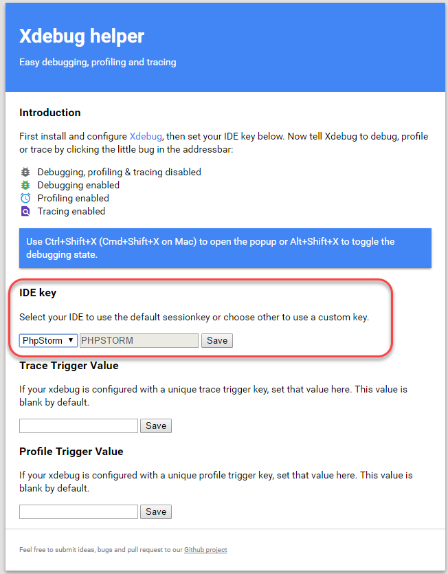

# Configure Xdebug

Xdebug is an extension for debugging your PHP code.

Cloud Docker for Commerce provides a separate container to handle Xdebug requests in the Docker environment. Use this container to enable Xdebug and debug PHP code in your Docker environment without affecting your Adobe Commerce on cloud infrastructure project configuration. The following explains how to configure Xdebug and PhpStorm to debug in your local Docker environment.

If you use Microsoft Windows, take the following steps before continuing:

1. Open **Settings** from the Docker menu or Docker Dashboard.
1. Select the **Expose daemon on tcp://localhost:2375 without TLS** checkbox.
1. Wait for the settings to apply.

## Enable Xdebug

1. To enable Xdebug for your Docker environment, generate the Docker Compose configuration file in developer mode with the `--with-xdebug` option and any other required options, for example.

   ```bash
   ./vendor/bin/ece-docker build:compose --mode="developer" --sync-engine="mutagen" --with-xdebug
   ```

   This command adds the Xdebug configuration to your `docker-compose.yml` file.

   ```yaml
    fpm_xdebug:
      hostname: fpm_xdebug.magento2.docker
      image: 'magento/magento-cloud-docker-php:7.4-fpm-1.3.2'
      extends: generic
      volumes:
        - '.:/app:ro,delegated'
        - 'magento-vendor:/app/vendor:ro,delegated'
        - 'magento-generated:/app/generated:ro,delegated'
        - 'magento-var:/app/var:rw,delegated'
        - 'magento-app-etc:/app/app/etc:rw,delegated'
        - 'magento-pub-media:/app/pub/media:rw,delegated'
        - 'magento-pub-static:/app/pub/static:rw,delegated'
        - '.docker/mnt:/mnt:rw,delegated'
      environment:
        - 'PHP_EXTENSIONS=bcmath bz2 calendar exif gd gettext intl mysqli pcntl pdo_mysql soap sockets sysvmsg sysvsem sysvshm opcache zip xsl sodium xdebug'
      networks:
        magento:
          aliases:
            - fpm_xdebug.magento2.docker
      depends_on:
        db:
          condition: service_started
   ```

1. Follow the steps to [launch the Docker environment in Developer mode](../deploy/developer-mode.md).

   The default Docker environment configuration sets the following Xdebug configuration variables:

   ```conf
   PHP_IDE_CONFIG=serverName=magento_cloud_docker
   XDEBUG_CONFIG=remote_host=host.docker.internal
   ```

1. Change any Xdebug configuration using the `XDEBUG_CONFIG` option. For example, to change the xdebug.remote_port option:

   ```bash
   XDEBUG_CONFIG='client_host=host.docker.internal client_port=9002'
   ```

   On Linux systems, use the following command instead:

   ```bash
   XDEBUG_CONFIG=client_host=host.docker.internal client_port=9002
   ```

**To configure PhpStorm to work with Xdebug**:

1. In your PhpStorm project, open the settings panel.

   -  _macOS X_—Select **PhpStorm** > **Preferences**.
   -  _Windows/Linux_—Select **File** > **Settings**.

1. In the _Settings_ panel, expand and locate the **PHP** > **Servers** section.

1. Click the **+** to add a `PHP Remote Debug` server configuration. The project name is in grey at the top.

1. Configure the following settings for the new server configuration:

   -  **Name**—Enter the name used for the `serverName` option from `PHP_IDE_CONFIG` value. By default, MCD uses this value: `serverName=magento_cloud_docker`
   -  **Host**—Enter `localhost`.
   -  **Port**—Enter `80`.
   -  **Debugger**—Select `Xdebug`.

1. Select **Use path mappings**. In the _File/Directory_ pane, the root of the project for the `serverName` displays.

1. In the **Absolute path on the server** column, click **Edit** and add a value to the `MAGENTO_ROOT` option. The default value is: `/app`

1. Change the Xdebug port to 9001 in the **PHP** > **Debug** > **Xdebug** > **Debug Port** panel.

1. Click **Apply**.

## Use Xdebug

The following steps describe debugging web requests and CLI commands.

**To debug web requests**:

1. In your PhpStorm project, click **Start listening** in the top navigation bar.

1. Add breakpoints in the `pub/index.php` file.

1. Install the debug extension in the browser, and then click **Debug** to enable.

1. In the browser, open the `https://localhost` URL.

1. When PhpStorm recognizes the Xdebug connection, you can begin debugging web requests.

You can debug any Adobe Commerce command or PHP script using the following steps.

**To debug CLI commands**:

1. In your PhpStorm project, open the **Build, Execution, Deployment** > **Docker** panel, and then click `+` to add a Docker server and update the following settings:

   -  **Name**—Enter a name for the server, for example `Docker Cloud`.
   -  **Connect to Docker daemon with**—
      -  _Windows_—Select **TCP socket** and update **Engine Api Url** with `tcp://localhost:2375`.
      -  _macOS X_—Select **Docker for Mac**. [_default_]

1. In the **PHP** > **Cli Interpreter** panel, click **[...]**.

1. Click **[+]** to add and configure a new Cli Interpreter from your Docker image. Update the following settings:

   -  **Name**—Enter a name for the new interpreter, such as `Magento cloud docker cli`
   -  **Remote**—Select `Docker`
      -  **Server**—Select `Docker Cloud` from the previous step.
      -  **Image name**—Select `magento/magento-cloud-docker-php:7.x-cli`
   -  **Additional** > **Debugger extension**:
      -  Windows—Enter `xdebug`
      -  macOS X/Linux—Enter `xdebug.so`
   -  Click **Refresh** to verify that the interpreter and Xdebug extension are configured properly.

1. Click **Save**.

1. Open the _Run/Debug Configuration_ window and add a **PHP script** with the following settings:

   - **Name**—Enter `bin/magento`
   - **Configuration** > **File**—Select the path to the `bin/magento` file in your local environment.

1. Add breakpoints in the `bin/magento` file and the debug PHP script created in the previous step.

## Using Xdebug Helper

You can install and use the Xdebug Helper Chrome extension to debug your PhP code from the browser.

**To use Xdebug Helper with Chrome**:

1. Install the [Xdebug Helper extension](https://chrome.google.com/webstore/detail/xdebug-helper/eadndfjplgieldjbigjakmdgkmoaaaoc?hl=en) from the Chrome store.

1. Enable the extension in Chrome as shown in the following figure.

   

1. In _Chrome_, click the debug icon in the Chrome toolbar.

   

1. From the _Xdebug helper_ menu, click **Options**.

1. From the _IDE Key_ list, select **PhpStorm**.

1. Click **Save**.

   
